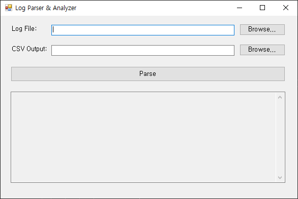
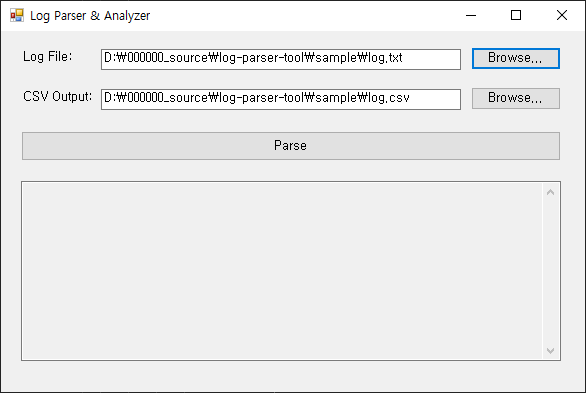
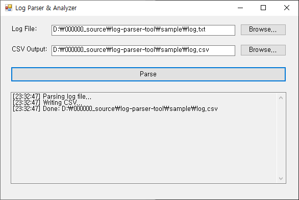

---

## Overview
A Windows GUI tool that helps non-technical teams parse large log files and export clean CSV reports quickly and reliably.

---

## What this is for
- Turning messy operational logs into consistent, analysis-ready CSV outputs.
- Supporting real-world batch processing with clear progress and results.

---

## Key features
- Simple GUI flow for non-technical users.
- Batch parsing with progress/status feedback.
- Clean CSV export with predictable structure.

---

## Edge cases handled
- Supports large log files with stable output and clear error reporting.
- Designed to continue safely when partial errors occur (with logs).
- Keeps results consistent even when input formats vary slightly.

---

## Maintenance-ready by design
Uses config-first settings and structured logging so the parsing rules and outputs can be safely extended and reused.

---

## Features

- Parse `[INFO]`, `[WARN]`, `[ERROR]` lines  
- Extract log level + message  
- Skip irrelevant/unknown lines  
- WinForms UI with:
  - File chooser  
  - CSV save dialog  
  - Real‑time logs  
- Includes sample log data

---

## Use Cases

- Extract meaningful logs (INFO/WARN/ERROR) from large server logs
- Convert messy log files into structured CSV for analysis
- Debug production issues by isolating important log events
- Preprocess logs for BI/analytics pipelines
- Provide small utility tools for ongoing system monitoring tasks

---

## Tech Stack

- **C# / .NET**
- **Regex**
- **File IO**
- **WinForms**

---

## Project Structure

/log-parser-tool
  /LogParser.Console
  /LogParser.WinForms
  /sample
    log.txt
    log.csv
  /screenshots
    01-main.png
    02-selected-file.png
    03-finished.png

---

## How to Use (WinForms)

1. Select `log.txt`  
2. Select CSV output file  
3. Click **Parse**  
4. Review results  

---

## How to Use (Console)

Run the console version from the project directory:

```bash
dotnet run
```

Default paths:
```text
Input file:    sample/log.txt
Output file:   sample/result.csv
```

You can also pass custom paths:
```bash
dotnet run "C:\logs\server.log" "C:\output\parsed.csv"
```

After running, the console will:
- Parse INFO/WARN/ERROR lines
- Skip irrelevant entries
- Generate result.csv with structured output

---

## Demo Video (YouTube)

[](https://youtu.be/U9jI7v6t96o)

You can watch a full demonstration of how the Log Parser works,  
including selecting the log file, parsing INFO/WARN/ERROR entries,  
and exporting them into a CSV file.

---

## Screenshots

| Main Window | Log Selected | CSV Exported |
|------------|---------------------|----------------------|
|  |  |  |

---

## Example Log Format

**Input:**

```text
[INFO] Application started
[WARN] Configuration file not found
[ERROR] Failed to connect to database

Some random line
[DEBUG] Debug message (ignored)
```

```text
Output CSV:
Level,Message
INFO,Application started
WARN,Configuration file not found
ERROR,Failed to connect to database
```

---

## Limitations

- Only INFO/WARN/ERROR supported
- DEBUG and other formats are ignored
- No timestamp extraction. If needed, I can add it quickly

---

## Enhancements

- Timestamp parsing
- Support DEBUG/TRACE
- Export JSON / Excel
- Log level filters in UI

---

## License

MIT License
Copyright (c) 2025